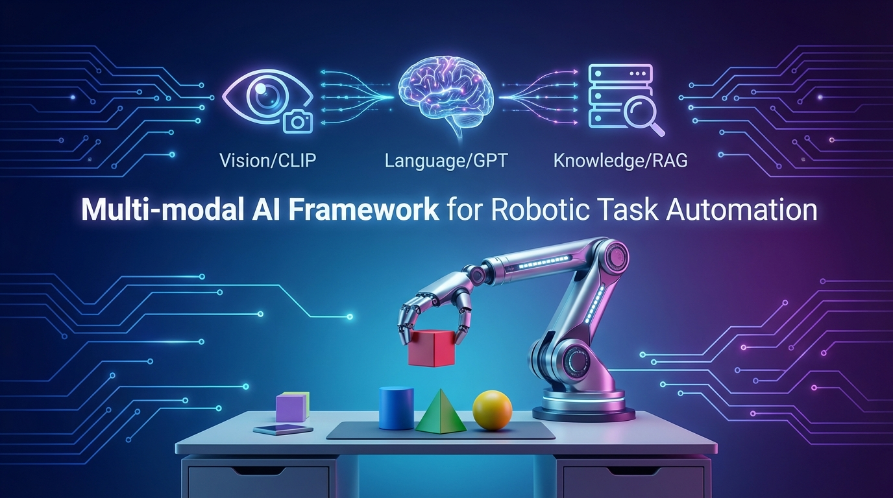

# Multi-modal AI Framework for Robotic Task Automation



[](https://docs.ros.org/en/humble/)
[](https://www.python.org/)
[](https://www.docker.com/)
[](LICENSE)

A sophisticated **multi-modal AI framework for robotic task automation** combining Vision (CLIP), Language Understanding (GPT-3.5), and Knowledge Retrieval (RAG) for natural language-driven robot control.

## 🎯 Overview

This framework enables robots to understand and execute natural language commands by integrating:

- **Vision Module**: CLIP-based image understanding and object detection
- **Language Module**: GPT-3.5 powered command parsing and intent extraction
- **RAG Module**: ChromaDB knowledge retrieval for manipulation strategies
- **ROS2 Integration**: Full Gazebo simulation with 3-DOF robot arm

### Example Commands

```bash
"Pick up the red block"
"Place it in the corner"
"Sort all blocks by color"
"Move the blue block to the left"
```

## ✨ Features

- 🤖 **Natural Language Control**: Intuitive robot commands in plain English
- 👁️ **Vision-Guided Actions**: CLIP-based visual context extraction
- 🧠 **Knowledge-Augmented**: RAG system for manipulation strategies
- 🎮 **Gazebo Simulation**: Safe testing environment with physics
- 🐳 **Docker Support**: Containerized deployment with GPU support
- 📦 **Modular Design**: Clean, extensible architecture

## 🏗️ Architecture

```
Natural Language Command
        ↓
   Multi-modal AI Framework Core
   ├── Vision Module (CLIP)
   ├── Language Module (GPT-3.5)
   └── RAG Module (ChromaDB)
        ↓
   Action Plan (ROS2 Topic)
        ↓
   Robot Controller
        ↓
   Gazebo Simulation
```

## 🚀 Quick Start

### Option 1: Docker (Recommended)

```bash
# 1. Clone repository
git clone <repository-url>
cd ai_agent_framework

# 2. Configure environment
cp .env.example .env
# Edit .env and add your OPENAI_API_KEY

# 3. Allow X11 forwarding (for Gazebo GUI)
xhost +local:docker

# 4. Build and run
docker-compose up -d
docker-compose exec ros2_humble bash

# 5. Inside container, launch the system
ros2 launch ai_agent_ros ai_agent_system.launch.py

# 6. In another terminal, send commands
docker-compose exec ros2_humble bash
ros2 topic pub /ai_agent/command std_msgs/msg/String "data: 'Pick up the red block'" --once
```

### Option 2: Native Installation (Ubuntu 22.04)

```bash
# 1. Install ROS2 Humble
# Follow: https://docs.ros.org/en/humble/Installation.html

# 2. Install dependencies
sudo apt-get update
sudo apt-get install -y \
    ros-humble-gazebo-ros-pkgs \
    ros-humble-ros2-control \
    ros-humble-ros2-controllers \
    python3-pip

# 3. Create workspace
mkdir -p ~/ros2_ws/src
cd ~/ros2_ws/src
git clone <repository-url> ai_agent_framework
ln -s ai_agent_framework/ros_integration ai_agent_ros

# 4. Install Python dependencies
cd ai_agent_framework
pip3 install -r requirements.txt

# 5. Configure environment
cp .env.example .env
# Edit .env and add your OPENAI_API_KEY

# 6. Build workspace
cd ~/ros2_ws
colcon build --symlink-install
source install/setup.bash

# 7. Launch system
ros2 launch ai_agent_ros ai_agent_system.launch.py
```

## 📦 Components

### Core Modules

| Module             | Description         | Technology                      |
| ------------------ | ------------------- | ------------------------------- |
| **RoboticAgent**   | Main orchestrator   | Python 3.10+                    |
| **VisionModule**   | Image understanding | CLIP (ViT-B/32)                 |
| **LanguageModule** | NLP processing      | GPT-3.5 Turbo                   |
| **RAGModule**      | Knowledge retrieval | ChromaDB + SentenceTransformers |

### ROS2 Integration

| Component             | Description                    |
| --------------------- | ------------------------------ |
| **ai_agent_node**     | Bridges AI framework with ROS2 |
| **robot_controller**  | Executes robot actions         |
| **Gazebo simulation** | 3-DOF arm + gripper + blocks   |

## 🎮 Usage

### Sending Commands

```bash
# ROS2 topic
ros2 topic pub /ai_agent/command std_msgs/msg/String "data: 'YOUR COMMAND'" --once

# Example commands
ros2 topic pub /ai_agent/command std_msgs/msg/String "data: 'Pick up the red block'" --once
ros2 topic pub /ai_agent/command std_msgs/msg/String "data: 'Place it in the corner'" --once
ros2 topic pub /ai_agent/command std_msgs/msg/String "data: 'Sort all blocks by color'" --once
```

### Monitoring

```bash
# Watch action plans
ros2 topic echo /ai_agent/action_plan

# Watch robot status
ros2 topic echo /robot_controller/status

# View camera feed
ros2 run rqt_image_view rqt_image_view /robot_arm/camera/image_raw

# List all topics
ros2 topic list

# Check node status
ros2 node list
```

## 📊 ROS2 Topics

| Topic                         | Type     | Direction | Description               |
| ----------------------------- | -------- | --------- | ------------------------- |
| `/ai_agent/command`           | `String` | Input     | Natural language commands |
| `/ai_agent/action_plan`       | `String` | Output    | Detailed action plans     |
| `/ai_agent/status`            | `String` | Output    | Agent status messages     |
| `/robot_controller/status`    | `String` | Output    | Robot execution status    |
| `/robot_arm/camera/image_raw` | `Image`  | Input     | Camera feed               |

## 🧪 Testing

```bash
# Run integration tests
cd ~/ros2_ws/src/ai_agent_framework
python3 -m pytest tests/test_integration.py -v

# Test individual modules
python3 tests/test_integration.py
```

## 🐳 Docker Commands

```bash
# Build image
docker-compose build

# Start container
docker-compose up -d

# Access container
docker-compose exec ros2_humble bash

# Stop container
docker-compose down

# View logs
docker-compose logs -f

# GPU-enabled version
docker-compose --profile gpu up -d
```

## 📚 Documentation

- [ROS Integration README](ros_integration/README.md) - Detailed ROS2 setup
- [Quick Start Guide](ros_integration/QUICKSTART.md) - 10-minute setup
- [Setup Instructions](ros_integration/SETUP_INSTRUCTIONS.md) - Comprehensive guide
- [Migration Guide](ros_integration/MIGRATION_GUIDE.md) - ROS1 to ROS2 migration

## 🛠️ Development

### Project Structure

```
ai_agent_framework/
├── src/                      # Core AI modules
│   ├── agent.py             # Main orchestrator
│   ├── language_module.py   # NLP processing
│   ├── rag_module.py        # Knowledge retrieval
│   └── vision_module.py     # Vision processing
├── ros_integration/          # ROS2 package
│   ├── scripts/             # ROS2 nodes
│   ├── launch/              # Launch files
│   ├── urdf/                # Robot models
│   └── worlds/              # Gazebo worlds
├── tests/                    # Integration tests
├── knowledge_base/          # RAG knowledge
├── Dockerfile               # Docker configuration
├── docker-compose.yml       # Docker Compose
└── requirements.txt         # Python dependencies
```

### Adding Knowledge

Edit `knowledge_base/manipulation_strategies.json`:

```json
[
  {
    "content": "When grasping blocks, approach from the top with 50% grip force.",
    "metadata": { "category": "grasping", "object": "block" }
  }
]
```

## 🔧 Configuration

### Environment Variables

```bash
# Required
OPENAI_API_KEY=sk-your-key-here

# Optional
CHROMA_DB_PATH=./chroma_db
KNOWLEDGE_BASE_PATH=./knowledge_base/manipulation_strategies.json
VISION_MODEL=openai/clip-vit-base-patch32
LANGUAGE_MODEL=gpt-3.5-turbo
DEVICE=auto  # cuda, cpu, or auto
```

## 🐛 Troubleshooting

### Docker Issues

```bash
# X11 permission denied
xhost +local:docker

# GPU not detected
docker-compose --profile gpu up -d

# Container won't start
docker-compose logs ros2_humble
```

### ROS2 Issues

```bash
# Nodes not found
source ~/ros2_ws/install/setup.bash

# Gazebo won't launch
killall gzserver gzclient
ros2 launch ai_agent_ros gazebo_simulation.launch.py

# No camera image
ros2 topic hz /robot_arm/camera/image_raw
```

## 📋 Requirements

- **OS**: Ubuntu 22.04 (Jammy) or Docker
- **ROS2**: Humble Hawksbill
- **Python**: 3.10+
- **GPU**: Optional (NVIDIA with CUDA for faster inference)
- **API Key**: OpenAI API key

## 📄 License

MIT License - see LICENSE file for details

## 🙏 Acknowledgments

- OpenAI for CLIP and GPT models
- ROS2 community
- Gazebo simulation team
- ChromaDB and LangChain projects

**Built with**: ROS2 Humble | Gazebo | Python 3.10 | Docker | AI/ML
